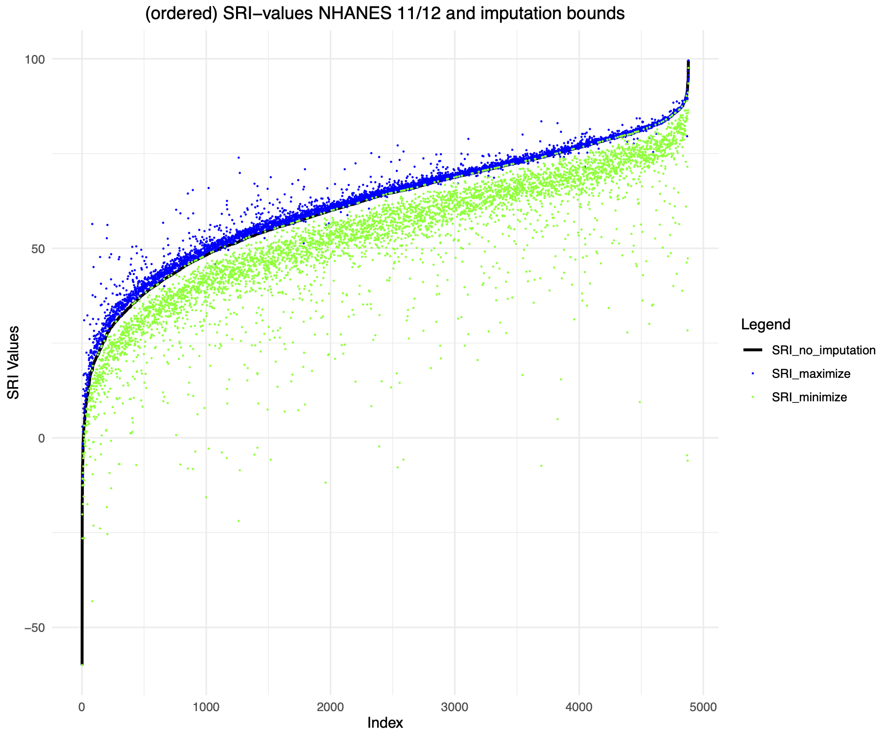

<!-- Standard Favicon -->
<link rel="icon" href="favicon.ico" type="image/x-icon">

<!-- For Safari and iOS devices -->
<link rel="apple-touch-icon" sizes="180x180" href="apple-touch-icon.png">

<!-- For multiple devices and screen sizes -->
<link rel="icon" type="image/png" sizes="32x32" href="favicon-32x32.png">
<link rel="icon" type="image/png" sizes="16x16" href="favicon-16x16.png">

<!-- For Android Chrome -->
<link rel="manifest" href="site.webmanifest">

<style>
.title {
  text-align: center;
}
</style>

# Project Gantt-Chart

```{r, echo=FALSE, message=FALSE, warning=FALSE, fig.width=10, fig.height=7}

library(ggalt)  # For the Gantt chart style
library(tidyverse)  # For data manipulation

# Create a sample Gantt chart data frame with a category column
gantt_data <- data.frame(
  task = c("Draft SRI Paper", 
           "Submit SRI Paper to SLEEP",
           "Development R package (base version)", 
           "Draft technical documentation Paper",
           "Submit technical documentation paper to JMBP",
           "Expansion of the R package to include additional features",
           "Draft SNF proposal with partners"), 
  start = as.Date(c("2025-03-01", 
                    "2025-09-01", 
                    "2025-03-01",
                    "2026-10-01",
                    "2026-10-01",
                    "2026-05-01",
                    "2026-05-01")),
  end = as.Date(c("2025-09-01", 
                  "2025-10-01", 
                  "2026-05-01",
                  "2025-10-01", 
                  "2026-11-01",
                  "2027-03-01",
                  "2027-03-01")),
  category = c("Draft", 
               "Submission", 
               "Development", 
               "Draft",
               "Submission",
               "Development",
               "Draft")  # Adding category
)

# Correctly reorder the 'task' factor levels to change the display order in the chart
gantt_data$task <- factor(gantt_data$task, levels = c(
  "Expansion of the R package to include additional features",
  "Development R package (base version)", 
  "Draft SRI Paper",  
  "Submit SRI Paper to SLEEP",  # Moved this task below "Draft SRI Paper"
  "Draft technical documentation Paper", 
  "Submit technical documentation paper to JMBP",  # Updated text here
  "Draft SNF proposal with partners"  # Include the missing task here
))

# Extract unique start and end dates
date_breaks <- unique(c(gantt_data$start, gantt_data$end))

# Create the Gantt chart using the correct geom_dumbbell parameters
ggplot(gantt_data, aes(x = start, xend = end, y = task, yend = task, color = category)) +
  geom_dumbbell(size = 3, 
                size_x = 5, size_xend = 5,  # Sizes for start and end points
                dot_guide = TRUE, dot_guide_size = 0.25) +  # Adding a dotted guide line
  theme_minimal() +
  theme(
    plot.title = element_text(hjust = 0.5, size = 20, face = "bold"),
    axis.title.x = element_text(size = 14, face = "bold"),
    axis.title.y = element_blank(),
    axis.text.y = element_text(size = 12, face = "bold"),
    axis.text.x = element_text(angle = 45, hjust = 1),  # Rotate x-axis labels 45 degrees
    legend.title = element_blank(),
    panel.grid.major.x = element_line(color = "gray80"),
    panel.grid.minor.x = element_blank()
  ) +
  labs(
    title = "",
    x = ""
  ) +
  scale_color_brewer(palette = "Set2") +
  scale_x_date(date_labels = "%b %Y",  # Format x-axis labels
               breaks = date_breaks)  # Show all unique start and end dates
```


# Sleep Regularity Index (SRI) Imputation Bounds

{width=65%}
{width=65%}
